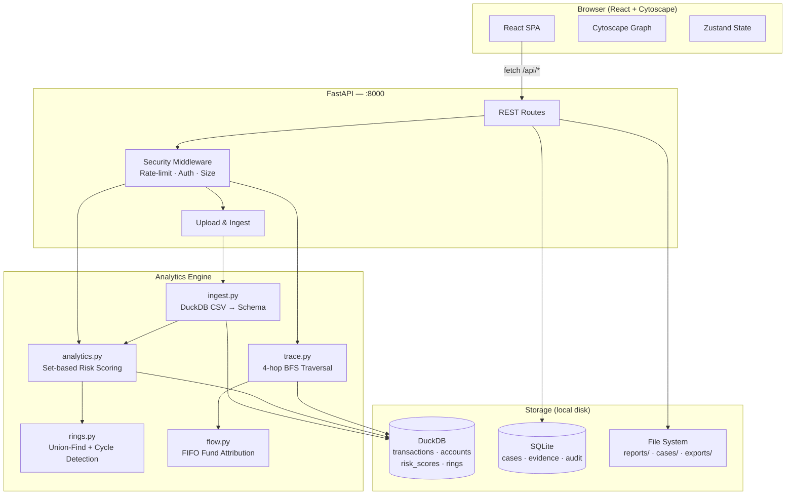
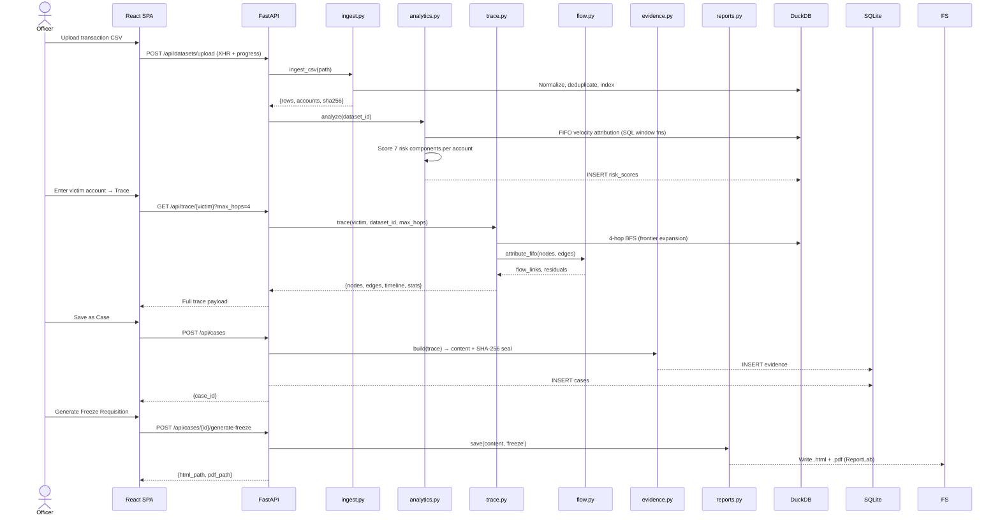

# Abhedya-Chakra — Architecture

> **Offline-first** cyber-financial intelligence platform for tracing mule-laundering trails, producing court-ready evidence seals, and generating freeze requisitions — entirely on your own hardware.

---

## Table of Contents

1. [What Needs to Be Installed](#1-what-needs-to-be-installed)
2. [High-Level Architecture](#2-high-level-architecture)
3. [Technology Stack](#3-technology-stack)
4. [Other Features & Technologies](#4-other-features--technologies)
5. [How the System Starts Up](#5-how-the-system-starts-up)
6. [Unified Server Architecture](#6-unified-server-architecture)
7. [Data Seeding](#7-data-seeding)
8. [Key Technical Flows](#8-key-technical-flows)
9. [Deployment Options](#9-deployment-options)
10. [Project Directory Map](#10-project-directory-map)

---

## 1. What Needs to Be Installed

### Minimum — Manual / One-Click Mode (Windows)

> [!TIP]
> This is the fastest path. Run `start.bat` and both servers launch in separate windows automatically.

| Requirement | Version | Purpose |
|---|---|---|
| **Python** | ≥ 3.11 | Backend runtime |
| **Node.js** | ≥ 18 LTS | Frontend dev server / build |
| **Git** | Any | Clone repository |

```
# One-time setup
python -m venv .venv
.venv\Scripts\activate
pip install -r requirements.lock

cd frontend && npm install && npm run build && cd ..

# Every subsequent run
start.bat
```

---

### Optional — Docker / Full Stack with Blockchain

> [!NOTE]
> Docker is only required if you want process isolation or Linux-parity on Windows. The application runs identically without it.

| Requirement | Purpose |
|---|---|
| **Docker ≥ 24** | Containerised deployment |
| **Ollama** (`qwen2.5:7b-instruct`) | Optional LLM-assisted trace validation |
| **Linux / systemd** | Production daemon via `deploy/abhedya.service` |

---

### External API Keys Required

None. The system is **fully offline by design**. The optional Ollama endpoint (`OLLAMA_URL`) is an env-var — if absent, the deterministic fallback validator runs instead.

---

## 2. High-Level Architecture

### The Layers



---

### Complete Data Flow — From Fraud Report to Proactive Freeze



---

## 3. Technology Stack

### Frontend

**Pages / Views**

| View | Route key | Purpose |
|---|---|---|
| Command Center | `overview` | System KPIs, dataset metrics |
| Investigate | `trace` | 4-hop graph, FIFO timeline, mule highlight |
| Account Lookup | `search` | Fuzzy account search + full dossier |
| Datasets | `datasets` | CSV upload with real-time XHR progress bar |
| Cases | `cases` | Saved investigations, document generation |
| Evidence & Reports | `evidence` | Generate & verify sealed PDF/HTML reports |
| Benchmarks | `benchmarks` | Measured ingest / analytics / trace latency |

**Key Frontend Technologies**

| Library | Version | Role |
|---|---|---|
| React | 18 | UI framework |
| Zustand | 5 | Global state (trace, theme, selection) |
| Cytoscape.js | 3.30 | Interactive network graph |
| Vite | 6 | Dev server (with `/api` proxy) + production build |
| Tailwind CSS | 3.4 | Utility styles (base layer only) |
| TypeScript | 5.7 | Type safety across all components |

**Key Frontend Components**

| Component | File | Description |
|---|---|---|
| `TraceView` | `App.tsx:609` | Main investigation workspace — graph, FIFO, timeline |
| `Datasets` | `App.tsx:262` | XHR upload with `uploading → indexing → done` phases |
| `Header` | `App.tsx:147` | Day/night toggle, API key input |
| `Sidebar` | `App.tsx:99` | Navigation, offline status |
| `App` | `App.tsx:1678` | Shell, `data-theme` attribute, route rendering |

---

### Backend

**API Routes**

| Method | Path | Description |
|---|---|---|
| `GET` | `/api/health` | Liveness check (no auth) |
| `GET` | `/api/ready` | Dataset loaded + DB reachable |
| `GET` | `/api/metrics` | Dataset row / account / flag counts |
| `POST` | `/api/datasets/upload` | Multipart CSV → ingest + analyze |
| `GET` | `/api/trace/{victim}` | Full 4-hop trace |
| `GET` | `/api/trace/{victim}/graph` | Nodes + edges only |
| `GET` | `/api/trace/{victim}/timeline` | Chronological events only |
| `POST` | `/api/trace/{victim}/validate` | LLM/deterministic trace validation |
| `GET` | `/api/accounts/search` | Fuzzy prefix search |
| `GET` | `/api/account/{id}` | Full account dossier + transactions |
| `POST` | `/api/cases` | Create case from trace |
| `GET` | `/api/cases` | List all cases |
| `POST` | `/api/cases/{id}/generate-freeze` | PDF freeze requisition |
| `POST` | `/api/cases/{id}/generate-case-diary` | PDF police case diary |
| `POST` | `/api/evidence` | Create sealed evidence bundle |
| `GET` | `/api/evidence/{id}/verify` | Verify SHA-256 seal integrity |
| `POST` | `/api/subgraph/export` | Export subgraph as JSON / CSV |
| `GET` | `/api/benchmarks` | Latest benchmark result JSON files |

**WebSocket Endpoints** — None (upload progress uses XHR `onprogress`; ingestion status is polled via `/api/ingestion/status`)

**Database Models**

*DuckDB — `data/datasets/{id}/abhedya.duckdb`*

| Table | Key Columns |
|---|---|
| `transactions` | `row_id, txn_id, sender_acct, receiver_acct, amount_paise, ts, mode, flags` |
| `accounts` | `account_id, account_number, bank_code, in_cnt, out_cnt, in_sum_paise, uniq_senders` |
| `risk_scores` | `account_id, score, components (JSON), reasons (JSON), role, tier, flagged` |
| `rings` | `ring_id, account_id` |

*SQLite — `data/app.sqlite`*

| Table | Purpose |
|---|---|
| `cases` | Investigation metadata + serialised trace JSON |
| `evidence` | SHA-256 sealed content bundles |
| `audit_log` | Immutable action log with `request_id` |
| `investigations` | Lightweight investigation index |

---

### Engine

**How the Risk Engine Works**

Each account receives a weighted composite score across **7 components** (total = 100 pts):

| Component | Weight | Signal |
|---|---|---|
| Velocity | 25 | % of incoming funds dispersed ≤ 15 min across ≥ 2 counterparties |
| Fan-in | 15 | Unique sender count + concentration of largest sender |
| Fan-out | 15 | Unique receiver count |
| Layering | 15 | Max of collector / distributor / terminal role scores |
| Terminal | 10 | Ratio of transactions with foreign IP, headless device, crypto/wallet narration |
| Cycle | 10 | Confirmed chronological A→B→C→A cycle within 24 h |
| Behaviour | 10 | Combined terminal ratio + pass-through delay signal |

Thresholds are fully configurable in [`config/detection.yaml`](config/detection.yaml).

**How Role Classification Works**

```
collector   → fan_in ≥ 40 AND fan_in ≥ distributor  →  L1
distributor → distributor ≥ 40                        →  L2
terminal    → terminal ≥ 35 AND terminal ≥ collector  →  L3
likely_mule → risk ≥ flag_threshold (default 60)
```

**How Ring / Cycle Detection Works**

1. **Union-Find (NumPy)** — builds connected components across all `(sender_id, receiver_id)` pairs in one vectorised pass
2. Components with ≥ 3 accounts are marked as ring candidates
3. A bounded DuckDB self-join confirms **chronological A → B → C → A** triangles within a 24-hour window
4. Confirmed cycle accounts receive the full cycle score (10 pts)

**FIFO Fund Attribution**

`flow.py` processes edges in timestamp order. For every non-victim account, only funds traceable to an earlier incoming edge can be forwarded. Any excess is explicitly marked `UNATTRIBUTED` and never propagated — preventing phantom attribution.

---

## 4. Other Features & Technologies

| Feature | Implementation |
|---|---|
| **SHA-256 Evidence Seals** | `evidence.py` — canonical JSON → SHA-256 → stored in SQLite; verifiable offline |
| **PDF Report Generation** | `reportlab` — Police Case Diary + Bank Freeze Requisition (A4, structured tables) |
| **LLM Trace Validation** | `validator.py` — Ollama (`qwen2.5:7b`) with grounding checks; deterministic fallback if offline |
| **Day / Night Theme** | CSS custom properties + `[data-theme="dark"]` overrides; persisted to `localStorage` |
| **Synthetic Data Generator** | `synth.py` — generates realistic mule-pattern CSVs for testing |
| **Audit Log** | Every API write action is appended to `audit_log` with `request_id` — tamper-evident |
| **Rate Limiting** | In-process sliding-window limiter (configurable via env vars, default 120 req / 60 s) |
| **Mule Chain Highlight** | Cytoscape style override — dims non-mule nodes to 15% opacity on toggle |

---

## 5. How the System Starts Up

```
start.bat
    │
    ├─► Activates .venv (Python)
    ├─► Sets ABHEDYA_START_DATASET=full-real
    │
    ├─► Window 1: "Abhedya Backend"
    │       python -m abhedya serve --host 127.0.0.1 --port 8000
    │           │
    │           ├─ validate_runtime()       check env constraints
    │           ├─ ensure_dirs()            create data/, logs/ if absent
    │           ├─ app_db()                 init SQLite schema (WAL mode)
    │           ├─ lifespan startup         log env + config hash
    │           └─ uvicorn starts           FastAPI ready at :8000
    │
    └─► Window 2: "Abhedya Frontend"
            cd frontend && npm run dev
                └─ Vite dev server at :5173
                   /api/* proxied → :8000
```

In **production** the frontend is pre-built into `static/` and served by FastAPI directly — no separate Vite process needed.

---

## 6. Unified Server Architecture

```
Browser  :5173 (dev) or :8000/static (prod)
    │
    ▼
Vite proxy (dev only)  ──► FastAPI :8000
                               │
                    ┌──────────┼──────────────┐
                    │          │              │
               Security    REST API      Static files
               Middleware   handlers     (index.html +
               (auth,rate,  (ingest,      React bundle)
               size check)   trace,
                             cases,
                             evidence,
                             reports)
                    │
          ┌─────────┴──────────┐
          │                    │
       DuckDB               SQLite
    (analytics +          (cases +
    transactions)          evidence +
                           audit)
```

The `spa_fallback` catch-all route (`GET /{path:path}`) returns `index.html` for every non-API path, enabling client-side routing without a separate web server.

---

## 7. Data Seeding

**Real Dataset (default)**
- `data/inbox/VoidHacks8_MuleAccount_2M_Transactions.csv` — 2,000,000 transactions
- Pre-built DuckDB at `data/datasets/full-real/abhedya.duckdb`
- Loaded at startup via `ABHEDYA_START_DATASET=full-real`

**Synthetic Dataset (testing)**
```bash
python -m abhedya synth --rows 10000 --output data/inbox/demo.csv
python -m abhedya ingest data/inbox/demo.csv --dataset-id demo
```

`synth.py` generates:
- 10 victim accounts sending to ~20 mule accounts
- Mule narrations containing `wallet payout`, `P2P crypto settlement`, `USDT transfer`
- Foreign IPs (`185.x.x.x`) and `Linux_Script` devices on crypto rows
- Timestamps spread across 15 days

---

## 8. Key Technical Flows

### CSV Ingest (streaming, set-based)

```
read_csv(parallel=true)  →  raw_stage (temp)
    └─► column normalisation (trim, cast, upper, regex flags)  →  norm_stage
         └─► deduplication QUALIFY row_number()=1  →  dedup_stage
              └─► INSERT INTO accounts (aggregated)
                   └─► INSERT INTO transactions (keyed joins)
                        └─► CHECKPOINT
```

Memory cap: 55% of available RAM (configurable via `ABHEDYA_MEMORY_LIMIT`).  
Measured throughput: **1,997,748 rows in 13.2 s** on the benchmark host.

### 4-Hop BFS Trace

```
frontier = {victim}
for hop in 1..max_hops:
    SELECT transactions WHERE sender_acct IN frontier  (LIMIT 5000)
    expand new receiver nodes → nextf
    frontier = nextf
→ FIFO attribution  →  timeline sort
```

### Evidence Seal Lifecycle

```
build(trace)
    │
    ├─ canonical JSON (sort_keys=True, no whitespace)
    ├─ SHA-256 digest → seal
    └─ content['seal'] = {content_sha256: seal}
         │
         └─► store() → SQLite evidence table
              │
              └─► verify() → recompute digest, compare
```

---

## 9. Deployment Options

| Mode | Command | Notes |
|---|---|---|
| **Windows dev** | `start.bat` | Two `cmd` windows; Vite proxy forwards `/api` |
| **Linux dev** | `scripts/run.sh` | Single shell; same proxy config |
| **Production (Linux)** | `systemd` unit | `deploy/abhedya.service`; serves built `static/` |
| **Manual ingest** | `python -m abhedya ingest <csv>` | CLI — no server needed |
| **Synthetic test** | `python -m abhedya synth` | Generates `data/inbox/demo.csv` |

**Environment Variables**

| Variable | Default | Purpose |
|---|---|---|
| `ABHEDYA_START_DATASET` | _(none)_ | Dataset ID loaded at startup |
| `ABHEDYA_API_KEY` | _(none)_ | Shared secret for all `/api/*` routes |
| `ABHEDYA_DATA_DIR` | `./data` | Data root override |
| `ABHEDYA_MAX_UPLOAD_BYTES` | `2 GiB` | Upload size cap |
| `ABHEDYA_RATE_LIMIT` | `120` | Max requests per window |
| `ABHEDYA_RATE_WINDOW_SECONDS` | `60` | Rate-limit window |
| `ABHEDYA_ALLOWED_ORIGINS` | _(none)_ | CORS origins (comma-separated) |
| `ABHEDYA_TRUSTED_HOSTS` | _(none)_ | Trusted host middleware |
| `OLLAMA_URL` | _(none)_ | LLM endpoint (e.g. `http://localhost:11434`) |
| `OLLAMA_MODEL` | `qwen2.5:7b-instruct` | Model name |

**Security Properties**
- All data stays on local disk — no external calls unless `OLLAMA_URL` is set
- API key checked via `hmac.compare_digest` (constant-time)
- Evidence seals are SHA-256 of canonical JSON — offline-verifiable
- Audit log is append-only, tied to each `request_id`
- systemd unit enforces `NoNewPrivileges`, `ProtectSystem=strict`, `PrivateTmp`

---

## 10. Project Directory Map

```
abhedya-chakra/
│
├── abhedya/                  # Python package — all backend logic
│   ├── app.py                # FastAPI application, all routes, middleware
│   ├── ingest.py             # DuckDB CSV ingestion pipeline
│   ├── analytics.py          # 7-component risk scoring engine
│   ├── rings.py              # Union-Find + cycle detection
│   ├── trace.py              # 4-hop BFS money trail
│   ├── flow.py               # FIFO fund attribution
│   ├── evidence.py           # SHA-256 evidence seal builder
│   ├── casework.py           # Case creation, listing, retrieval
│   ├── reports.py            # PDF/HTML report generation (ReportLab)
│   ├── validator.py          # LLM/deterministic trace validator
│   ├── synth.py              # Synthetic dataset generator
│   ├── storage.py            # DuckDB + SQLite connection helpers
│   ├── config.py             # Env vars, dir helpers, runtime validation
│   └── __main__.py           # CLI: serve · ingest · synth · init
│
├── frontend/                 # React + TypeScript SPA
│   ├── src/
│   │   ├── App.tsx           # All views and components (single-file)
│   │   ├── styles.css        # Tailwind base + custom theme + dark mode
│   │   ├── api/client.ts     # Typed fetch wrapper
│   │   └── validation.ts     # Account ID format validation
│   ├── vite.config.ts        # Vite config + /api proxy
│   └── tailwind.config.js
│
├── static/                   # Production React build output (served by FastAPI)
│
├── config/
│   ├── detection.yaml        # Risk weights, thresholds, flag config
│   └── banks.yaml            # IFSC prefix → bank name mapping
│
├── data/                     # Runtime data root (gitignored)
│   ├── inbox/                # Uploaded CSV staging area
│   ├── datasets/{id}/        # Per-dataset DuckDB files
│   ├── reports/              # Generated HTML + PDF reports
│   ├── exports/              # Subgraph JSON / CSV exports
│   └── app.sqlite            # Cases, evidence, audit log
│
├── cases/                    # Per-case artefacts (case.json, graph.json, documents/)
├── deploy/abhedya.service    # systemd production unit
├── scripts/                  # setup.sh, run.sh, backup.sh, blind_test.py
├── benchmarks/               # Benchmark scripts + results/
├── docs/                     # Extended docs (SECURITY, DETECTION, EVIDENCE…)
├── tests/                    # pytest test suite
├── requirements.lock         # Pinned Python dependencies
├── start.bat                 # Windows one-click launcher
└── ARCHITECTURE.md           # This file
```

---

> Legal reports are analytical templates only. Statutory provisions and placeholders must be confirmed by the Investigating Officer before any official use.
