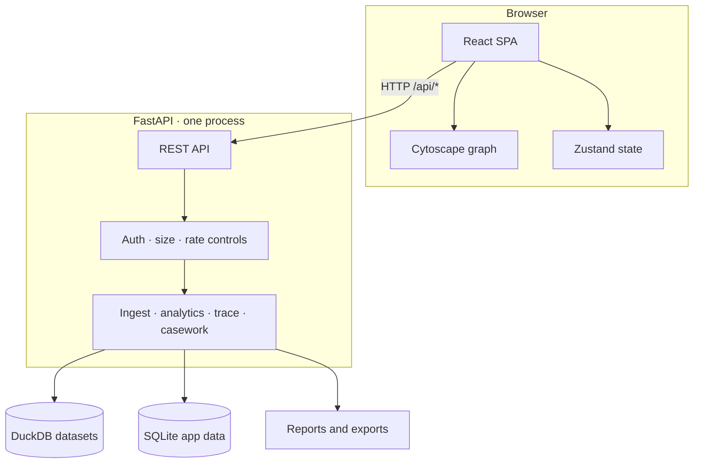
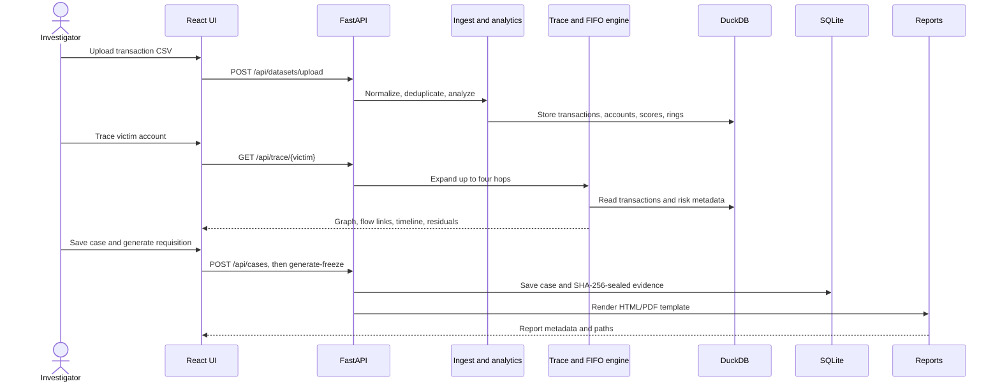

# Architecture

Abhedya-Chakra is a local-first transaction investigation application. The backend serves a React single-page application and a JSON API; analysis and case data remain on local storage.

## 1. Requirements and integrations

- **Windows development:** Python 3.11+, Node.js 18+, npm. Run `start.bat` after installing the Python and frontend dependencies.
- **External API keys:** None for local use. Production requires an operator-managed `ABHEDYA_API_KEY`. Optional Ollama validation uses a locally configured `OLLAMA_URL`; no blockchain or Docker integration is shipped.
- **Data:** Transaction datasets are not automatically seeded or bundled. Upload a CSV in the UI or generate a demo with `python -m abhedya synth`.

## 2. High-level architecture



### Complete flow: report to freeze requisition



Report generation does not contact a bank or execute an account freeze. An authorized investigator must review and submit any resulting document.

## 3. Technology stack

| Layer | Technologies and responsibilities |
|---|---|
| Frontend | React 18, TypeScript, Vite, Zustand, Cytoscape.js, Tailwind CSS. Views include Overview, Datasets, Investigate, Account Lookup, Cases, Evidence & Reports, and Benchmarks. |
| Backend | Python, FastAPI, Uvicorn. Key routes include `/api/datasets/upload`, `/api/accounts/search`, `/api/trace/{victim}`, `/api/cases`, `/api/evidence`, and `/api/reports/{evidence_id}`; health, readiness, lookup, and export routes are also available. |
| Storage | DuckDB stores dataset transactions, account aggregates, risk scores, and rings. SQLite stores cases, evidence, audit events, and schema metadata. |
| Reports | Jinja2/HTML and ReportLab/PDF output. |

Ingestion status is polled through `/api/ingestion/status`; there are no WebSocket endpoints. The Vite development server proxies `/api` to FastAPI. Production serves the built SPA from `static/`.

## 4. Detection and investigation features

Risk scores combine configurable **velocity, fan-in, fan-out, layering, terminal indicators, cycle, and behaviour** signals. Default weights total 100 and the flag threshold is 60; see [`config/detection.yaml`](config/detection.yaml). These are explainable, rule-based risk scores—not predictions from a trained machine-learning model. Traces expand up to four hops, render as a directed graph, and include FIFO fund attribution, unattributed residuals, and a chronological timeline. Account/transaction lookup, case management, JSON/CSV subgraph export, evidence verification, and HTML/PDF reports are also available.

## 5. Startup sequence

1. Create a Python environment and install `requirements.lock`; run `npm ci` in `frontend/`.
2. Run `python -m abhedya init` to prepare local directories and the SQLite schema.
3. Ingest a CSV (`python -m abhedya ingest <csv> --dataset-id <id>`) or upload it after starting.
4. Set `ABHEDYA_START_DATASET` to an ingested dataset ID.
5. Run `start.bat`: FastAPI starts on `127.0.0.1:8000`; Vite starts separately and proxies API requests.

The launcher defaults the selected dataset ID to `full-real`; that dataset must already exist. For a clean checkout, ingest or generate a dataset first and set the environment variable as shown in the README. There is no automatic seed or first-run database import.

## 6. Unified server model

During development, the browser talks to Vite and Vite proxies API requests to FastAPI. For deployment, build with `npm run build` from `frontend/`; the bundle is written to `static/` and FastAPI serves the UI and API on the same origin. The application is designed for a single process and local/private deployment.

## 7. Data generation

`python -m abhedya synth --rows 10000 --output data/inbox/demo.csv` writes deterministic synthetic CSV data (default seed `7`) with victim-to-mule flows and illustrative terminal indicators. It creates test input only; it does not automatically ingest or load the dataset.

## 8. Key technical flows

- **Ingest:** CSV parsing and normalization → deduplication → DuckDB transactions/account aggregates → configured risk analysis and ring detection.
- **Trace:** bounded hop-by-hop transaction expansion → risk metadata enrichment → FIFO attribution → graph, residuals, and timeline.
- **Evidence:** canonicalized trace content → SHA-256 seal → SQLite storage → verification before report generation.

## 9. Deployment options

- **Windows/local development:** `start.bat`.
- **Linux/local development:** `scripts/setup.sh`, then `scripts/run.sh`.
- **Linux service:** `deploy/abhedya.service` behind a TLS-terminating reverse proxy; see [Production operations](docs/PRODUCTION.md).

Docker Compose and blockchain deployment are not currently provided. Do not expose the development server directly to the public internet.

## 10. Project directory map

```text
abhedya/       FastAPI app, ingestion, analytics, trace, storage, reports
config/        Bank labels and configurable detection thresholds/weights
frontend/src/  React application and UI styles
static/        Built frontend served by FastAPI
data/          Local datasets, SQLite state, reports, and exports
scripts/       Setup, run, and backup helpers
deploy/        Linux systemd service definition
tests/         Backend tests
benchmarks/    Performance scripts and result data
docs/          Security, operations, evidence, and detection guides
```
